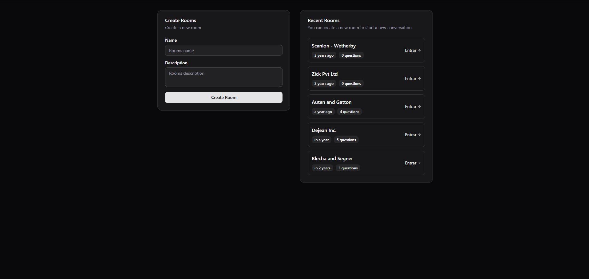
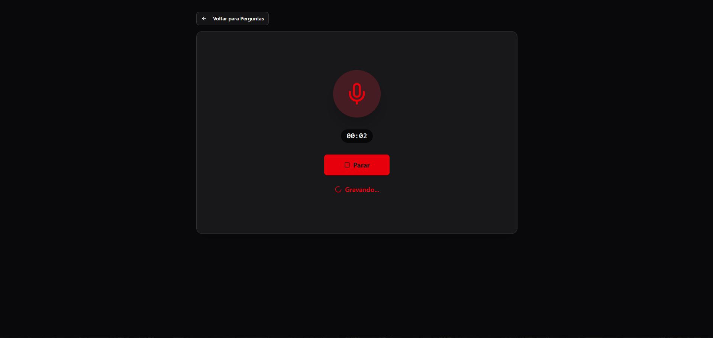
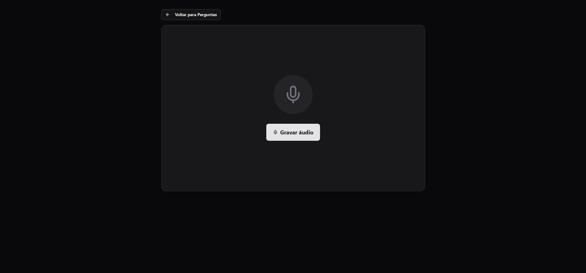

# NLW Agents

Frontend do projeto NLW Agents desenvolvido durante o evento da Rocketseat.

## 🚀 Tecnologias Utilizadas

-   **React** - Biblioteca para construção de interfaces de usuário
-   **TypeScript** - Superset do JavaScript com tipagem estática
-   **Vite** - Build tool e bundler moderno
-   **Tailwind CSS** - Framework CSS utilitário para estilização
-   **React Router DOM** - Roteamento no lado do cliente
-   **React Query** - Gerenciamento de estado servidor e cache
-   **Radix UI** - Componentes acessíveis e sem estilo
-   **Lucide React** - Biblioteca de ícones
-   **Class Variance Authority** - Utilitário para variantes de componentes
-   **Tailwind Merge** - Utilitário para merge de classes Tailwind

## Preview

<div align="center">
  
  
  
  
</div>

## 📁 Estrutura do Projeto

```text
web/
├── src/
│   ├── assets/
│   │   └── project/         # Imagens de apresentação do projeto
│   ├── components/          # Componentes reutilizáveis
│   │   └── ui/              # Componentes de interface
│   ├── pages/               # Páginas da aplicação
│   ├── lib/                 # Utilitários e configurações
│   ├── app.tsx              # Componente principal da aplicação
│   └── main.tsx             # Ponto de entrada
├── public/                  # Arquivos estáticos
└── index.html               # Template HTML
```
